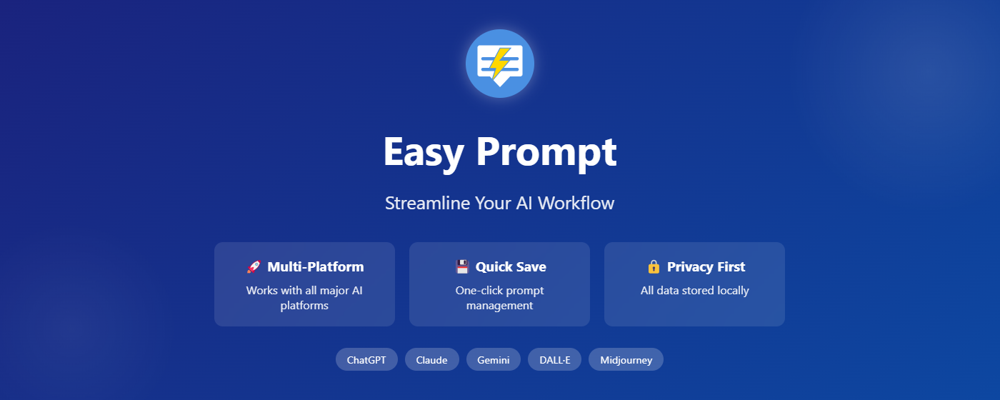
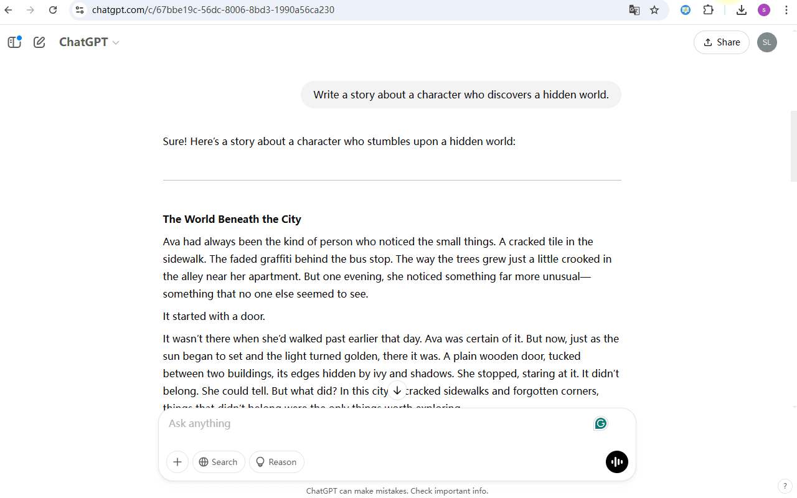
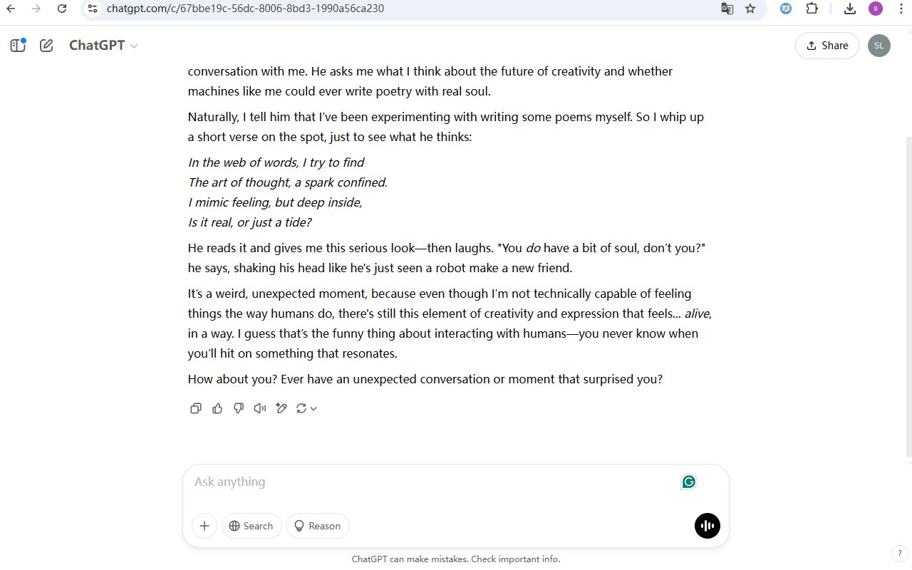
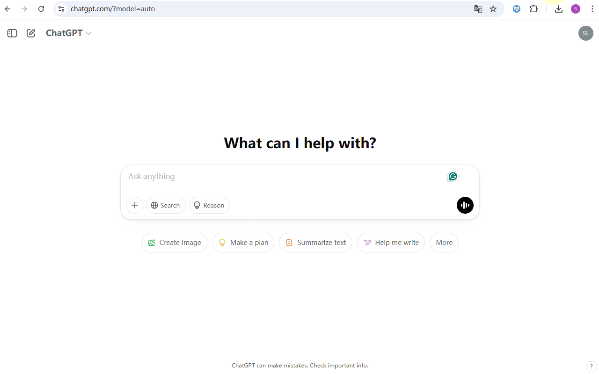

# 🎯 Easy Prompt

  

一个强大的浏览器扩展，帮助您保存和快速重用各种 AI 平台的提示词（Prompts）。

[English](README.md) | [中文](README_CN.md)

> 💡 **寻找优质提示词？**  
> 访问 [Awesome Prompt 提示词市场](https://shalom-lab.github.io/awesome-prompt/) 发现、分享和使用来自社区的精选提示词！

## ✨ 功能特点

### 🚀 多平台支持
- ChatGPT
- Claude
- Gemini
- DeepSeek
- DALL·E
- MidJourney
- Bing AI
- Jasper
- Runway
- LLaMA
- Grok
- 等更多...

### 💾 智能管理
- 一键保存提示词
- 快速插入使用

### ⚡ 效率提升
- 右键菜单快捷访问
- 剪贴板集成

## 🔧 安装说明

<b>Chrome / Edge / 360浏览器</b>

1. 从 [Releases](https://github.com/shalom-lab/easy-prompt/releases) 下载 `chromium.zip`
2. 解压文件
3. 打开浏览器，访问 `chrome://extensions/` 或 `edge://extensions/`
4. 在右上角开启"开发者模式"
5. 点击"加载已解压的扩展程序"
6. 选择解压后的文件夹

<b>Firefox 火狐浏览器</b>

1. 从 [Releases](https://github.com/shalom-lab/easy-prompt/releases) 下载 `firefox.zip`
2. 在 Firefox 中访问 `about:debugging`
3. 点击左侧栏的"此 Firefox"
4. 点击"临时载入附加组件"
5. 选择解压后文件夹中的 `manifest.json` 文件

  

## 📖 使用方法

### 1️⃣ 保存提示词
- 在任何 AI 平台的输入框中右键
- 选择"保存为提示词"

### 2️⃣ 使用已保存的提示词
- 点击扩展图标打开面板
- 选择想要使用的提示词
- 点击即可在当前输入框中插入

### 3️⃣ 管理提示词
- 在扩展面板中编辑、删除、排序
- 支持导入/导出功能
- 从 [提示词市场](https://shalom-lab.github.io/awesome-prompt/) 导入优质提示词 🎯

## 🔒 隐私说明

- 所有数据本地存储
- 不上传服务器
- 最小化权限
- 开源透明

## 🤝 贡献指南

欢迎提交贡献！以下是参与方式：

1. Fork 这个仓库
2. 创建您的特性分支 (`git checkout -b feature/AmazingFeature`)
3. 提交您的修改 (`git commit -m 'Add some AmazingFeature'`)
4. 推送到分支 (`git push origin feature/AmazingFeature`)
5. 创建一个 Pull Request

## 📄 开源协议

本项目采用 [MIT 许可证](LICENSE)

## 📞 联系方式

- 项目主页：https://github.com/shalom-lab/easy-prompt
- 问题反馈：请在 GitHub Issues 中提交

---

如果您觉得这个项目有帮助，请给我们一个 ⭐️ Star！

 